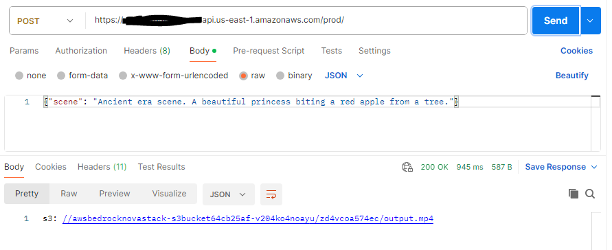
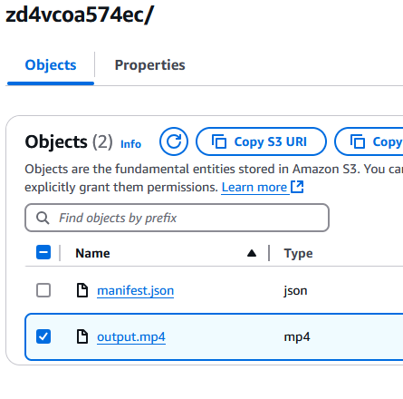

# Amazon Bedrock with Nova - Generate Video
In this example, we demonstrate [Amazon Bedrock](https://aws.amazon.com/bedrock/) to generate videos.  We then expose the model response location of S3 Bucket using AWS API Gateway endpoint.

This application is developed using AWS CDK in TypeScript.

## What does it build?
* Creates and deploys Amazon BedRock with Amazon Nova Video Generation Model
* Creates a Lambda that will interact with the Model
* Creates a S3 bucket where the video files will be stored
* Creates an AWS API Gateway endpoint to expose that Lambda which returns the video location on S3 Bucket

## Steps to run and test
* Deploy the CDK code. Wait for the deployment to finish.  It will print out the API endpoint for you to use.
  * 
* Wait a few minutes since video generation can take a while.
* Check your S3 bucket for the MP3 file created by Amazon Bedrock
  * 
* Download the MP4 file and play the video.

### Resulting Model Response Video
https://github.com/user-attachments/assets/da6c2fef-9594-4a8b-a8f7-661bd4c3c2d9
* If that video link doesn't play, download the original Amazon Nova video file in [MP4](output.mp4) format under files.

## References
* [Amazon Bedrock](https://aws.amazon.com/bedrock/)
* [Amazon Nova](https://docs.aws.amazon.com/nova/latest/userguide/what-is-nova.html)
